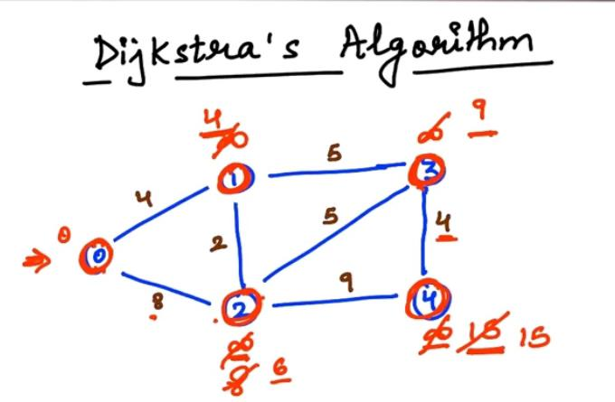
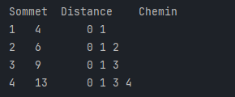

# Dijkstra's Algorithm

## Introduction

Dijkstra's Algorithm is a popular algorithm used for finding the shortest paths between nodes in a graph. It was conceived by computer scientist Edsger W. Dijkstra in 1956 and published three years later. The algorithm is used in various applications, such as routing and network protocols.

## Algorithm Explanation

Dijkstra's Algorithm works by iteratively selecting the node with the smallest tentative distance, updating its neighbors' tentative distances, and marking the selected node as "visited." The algorithm continues until all nodes have been visited or the shortest path to the destination node has been found.

## Example Illustration

The provided graph and table illustrate how Dijkstra's Algorithm can be applied to find the shortest path from a source node (0) to all other nodes.

### Graph Representation

The graph provided in the image represents the following:
- Nodes: 0, 1, 2, 3, 4
- Edges with weights representing the cost to traverse between nodes.

### Step-by-Step Execution

1. **Initialization**:
    - Start from node 0.
    - Tentative distances to all other nodes are set to infinity, except for the start node which is set to 0.

2. **First Iteration**:
    - Select node 0 (distance = 0).
    - Update the tentative distances of its neighbors (node 1, node 2).

3. **Second Iteration**:
    - Select the node with the smallest tentative distance (node 1, distance = 4).
    - Update the tentative distances of its neighbors (node 3).

4. **Third Iteration**:
    - Select node 2 (distance = 6).
    - Update the tentative distances of its neighbors (node 4).

5. **Fourth Iteration**:
    - Select node 3 (distance = 9).
    - Update the tentative distances of its neighbors (node 4).

6. **Fifth Iteration**:
    - Select node 4 (distance = 13).

### Result Table

The table provided shows the final shortest distances from node 0 to all other nodes and the paths taken:

| Node (Sommet) | Distance | Path (Chemin)  |
|---------------|----------|----------------|
| 1             | 4        | 0 -> 1         |
| 2             | 6        | 0 -> 1 -> 2    |
| 3             | 9        | 0 -> 1 -> 3    |
| 4             | 13       | 0 -> 1 -> 3 -> 4 |

## Conclusion

Dijkstra's Algorithm is an efficient way to find the shortest path in a graph with non-negative weights. The provided example illustrates the algorithm's steps and shows the final shortest paths and distances.

## Usage

To use Dijkstra's Algorithm in your own projects, you can follow the logic illustrated in this example. Ensure your graph is represented correctly, and follow the algorithm's steps to compute the shortest paths.

## Contributing

Contributions are welcome! Please feel free to submit a pull request or open an issue if you have any suggestions or improvements.
